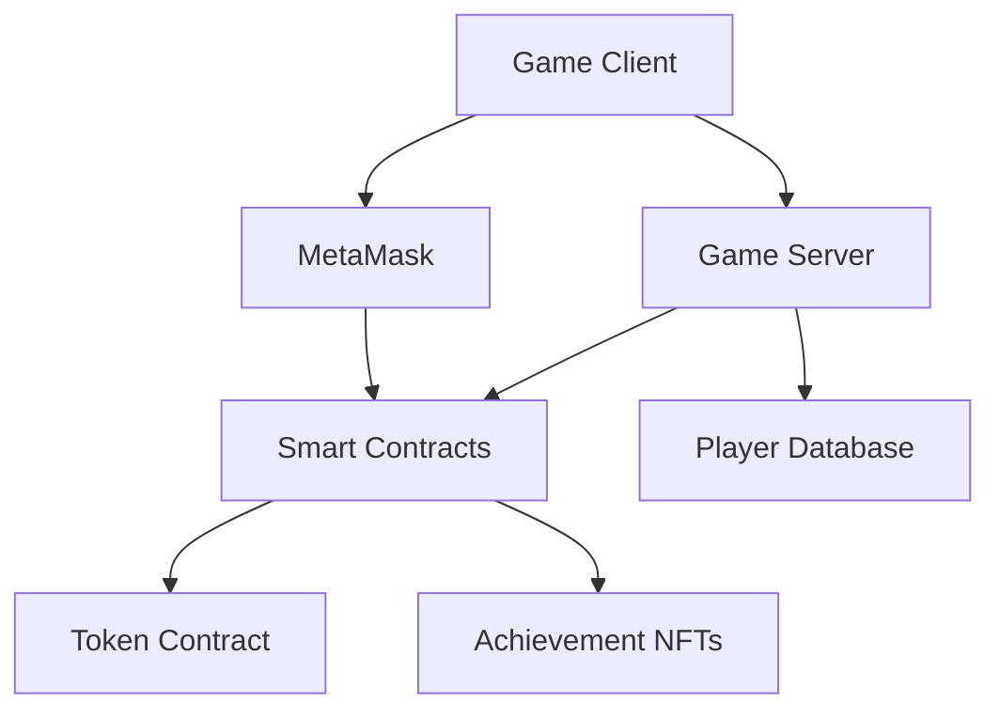

# Technical Architecture

## System Overview

## Components

### Game Client
- Unity-based iOS app
- Web3 integration via MetaMask
- Real-time location tracking
- AR capabilities

### Game Server
- WebSocket for real-time communication
- Player position synchronization
- Score tracking and verification
- Achievement progress monitoring

### Blockchain Integration
- Ethereum Sepolia testnet
- Smart contracts for tokens and NFTs
- MetaMask for wallet connection
