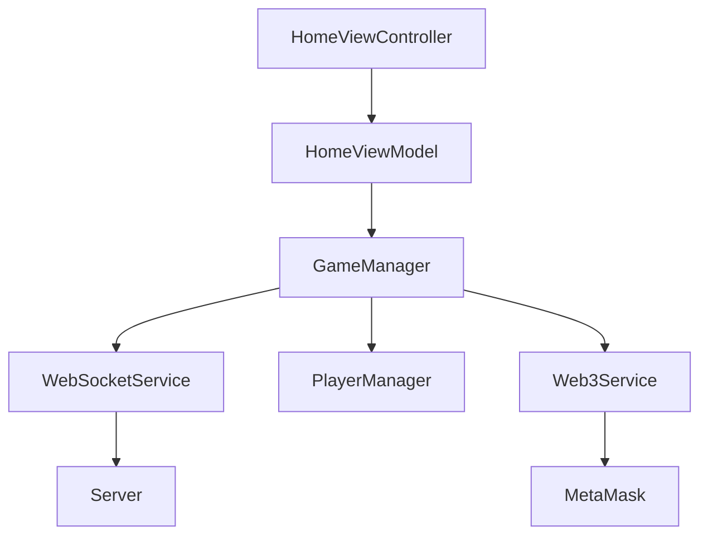
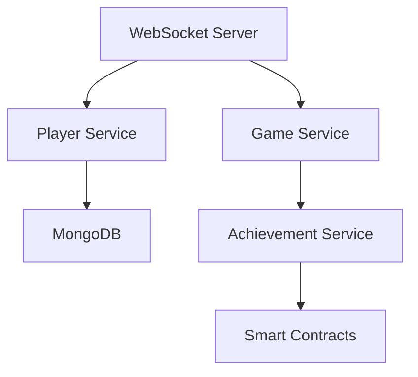

# System Design

## Client Architecture

## Server Architecture

## Data Flow
- Real-time player position updates
- Event-based shot detection
- Achievement progress tracking
- Token rewards distribution